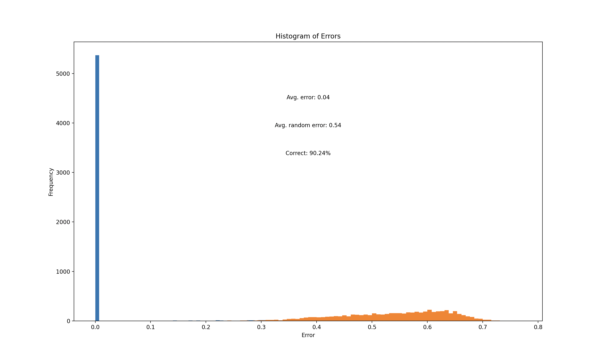
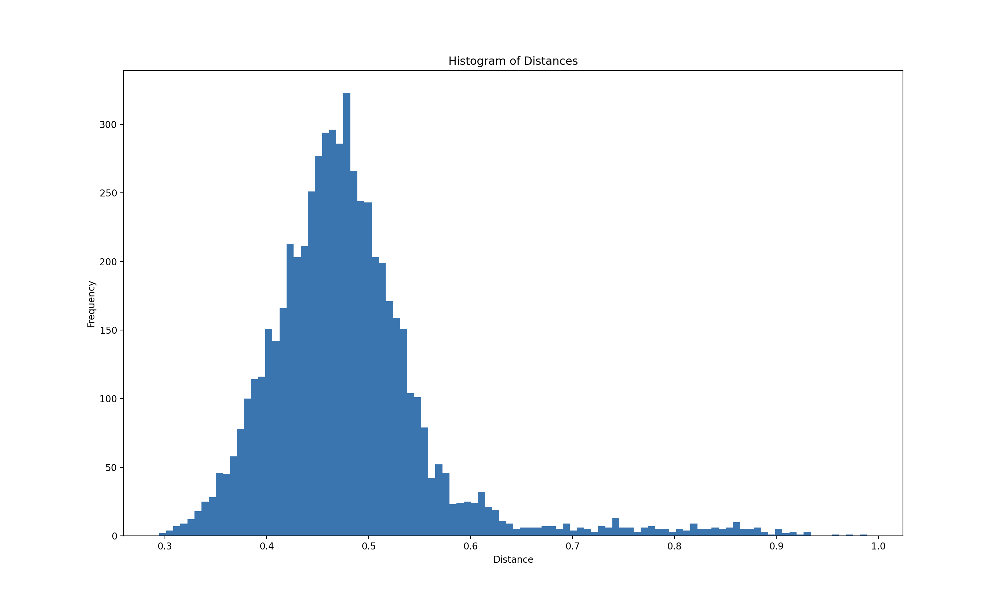

<!--
Author: Walter Shewmake <walter.shewmake@utahtech.edu>
Date: 05-19-2024

Project: Arbitrary Hierarchical Classifier
Client: Zonos
Affiliation: Utah Tech University

This file is part of the Arbitrary Hierarchical Classification Application developed for Zonos.
-->

# FastAPI Classifier on AWS with PostgreSQL

[Setup](#setup) | [Prerequisites](#prerequisites) | [Steps](#steps) | [Parsing Hierarchical Data](#parsing-hierarchical-data) | [Profiling Results](#profiling-results) | [Accuracy](#accuracy)

# Setup

This guide outlines the steps required to set up an AWS environment to run the FastAPI classifier application with a PostgreSQL database using Elastic Beanstalk and RDS.

## Prerequisites

- AWS account
- AWS CLI installed and configured
- Elastic Beanstalk CLI (EB CLI) installed
- AWS IAM user with necessary permissions

## Steps

1. `brew install awsebcli` or `pip install awsebcli`
2. `eb init` and follow the prompts
3. `eb create` and follow the prompts
4. `eb console` to open the console in a browser
5. Create an RDS instance in the same VPC as the Elastic Beanstalk environment
6. Enable the pgvector extension on the RDS instance by connecting to the database and running the following command:
   ```sql
   CREATE EXTENSION vector;
   ```
7. Add the following environment variables to the Elastic Beanstalk environment:
   ```env
   OPENAI_API_KEY=<your_openai_api_key>
   ```
8. `eb deploy` to deploy the application

# Parsing Hierarchical Data

The classifier expects a uniform data format in order to provide accurate predictions. There is no mechanism for automatically inserting files into the database on deployment, so you'll need to connect to the remote database from your local machine. The following steps outline how to parse hierarchical data into a format suitable for the classifier:

1. Create a `.env` file in the root directory of the project and add the following environment variables:
   ```env
   RDS_DB_NAME=<your_db_name>
   RDS_USERNAME=<your_db_username>
   RDS_PASSWORD=<your_db_password>
   RDS_HOSTNAME=<your_db_hostname>
   RDS_PORT=<your_db_port>
   OPENAI_API_KEY=<your_openai_api_key>
   ```
2. Create a python virtual environment and install the required dependencies:
   ```bash
   python -m venv venv
   source venv/bin/activate
   pip install -r requirements.txt
   ```
3. Note the hierarchy type and file structure, and determine if one of the existing transformers can be used (see `file_parser/transformers`). If it can, prefix the file name with the hierarchy in all caps, for example, UN_SPSC_1.csv" If there is no existing transformer capable of parsing the file, create a new transformer class that inherits from `BaseTransformer` and implements the `parse` method. The BaseTransformer class was created with flexibility and future expansion in mind, so it should be easy to extend. The transformer should be placed in the `file_parser/transformers` directory.
4. Run the file parser using the following command:
   ```bash
   python -m file_parser <file_path>
   ```

# Profiling Results

### Setup

- **DB**: AWS RDS PostgreSQL `db.t3.xlarge` (peaked at 22% CPU, could probably get away with a t3.small)
- **EB**: Python 3.9 running on 64bit Amazon Linux 2023/4.0.12
- **EC2**: Seven `t3.micro` instances running behind a load balancer (each capable of 7-12 RPS, so you could get away with five instances for 50 RPS)
- **Classifier**: OpenAI `text-embedding-3-large`

### Usage

- **DB**: Peaked at `22%` CPU usage
- **EB**: Peaked at `15%` CPU usage avg. across all instances
- **Classifier**: Peaked at `49.5` RPS (99% of OpenAI's tier 1 limit)

### Results


### Observations

After increasing the number of users from 20 to 21, the RPS began to drop off, likely due to the classifier reaching the OpenAI tier 1 limit. The CPU usage on the EB instances remained low, so the bottleneck is likely OpenAI. The RDS instance was able to handle the load without issue, so the next step would be to upgrade the OpenAI plan to increase the RPS limit, and then continue to increase the number of users until the CPU usage maxes out on the EB instances or the RDS instance.

# Accuracy

## Chart 1

## Description

A histogram representing 6000 demo items randomly sampled from a Taxonomy dataset that shows (in blue) the distribution of the cosine distances between the correct leaf node (`y`) in the hierarchy and the leaf node identified by the classifier (`y^`), and (in orange) the distribution of the cosine distances between the correct leaf node (`y`) and the randomly selected leaf node (`y_rand`). 6000 classifications were made in total, and 6000 random leaf nodes were selected.




### Observations

- The distribution of the cosine distances between `y` and `y^` is centered around `0`. This indicates that the classifier is able to identify the correct leaf node in the hierarchy with high accuracy.
- The distribution of the cosine distances between `y` and `y_rand` is centered around `0.5`. This indicates that randomly selected leaf nodes are far from the correct leaf node in the hierarchy.

## Chart 2

## Description

A histogram that shows (in blue) the distribution of the cosine distances between the correct leaf node (`y`) in the hierarchy and generated embedding of the input item (`v`).



